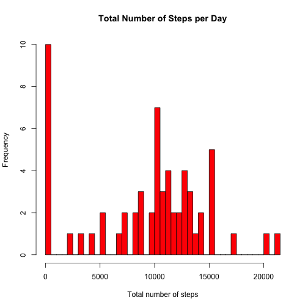
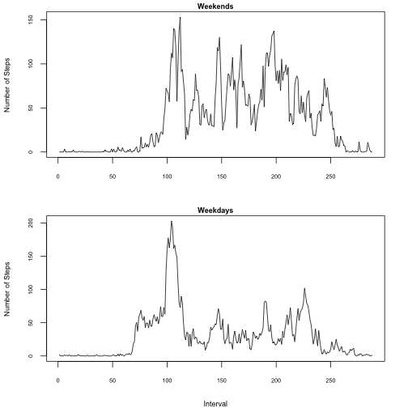

Reproducible Research: Peer Assessment 1
========================================================

## Loading and preprocessing the data


```r
activity <- read.csv("activity.csv")
```


## What is mean total number of steps taken per day?

1. Make a histogram of the total number of steps taken each day


```r
x <- tapply(activity$steps, activity$date, sum)
hist(x, main = "Total Number of Steps per Day", breaks = 60, col = "red", xlab = "Total number of steps")
```

 


2. Calculate and report the **mean** and **median** total number of steps taken per day


```r
mean(as.numeric(x), na.rm = TRUE)
```

```
## [1] 10766
```


Median =

```r
median(as.numeric(x), na.rm = TRUE)
```

```
## [1] 10765
```


## What is the average daily activity pattern?

1. Make a time series plot (i.e. type = "l") of the 5-minute interval (x-axis) and the average number of steps taken, averaged across all days (y-axis)


```r
y <- tapply(activity$steps, activity$interval, mean, na.rm = TRUE)
plot(y, type = "l", main = "Average Daily Activity Pattern", cex.main = 0.75, 
    cex.lab = 0.75, cex.axis = 0.6, ylab = "Number of Steps", xlab = "Interval")
```

 


2. Which 5-minute interval, on average across all the days in the dataset, contains the maximum number of steps?


```r
subset(y, y == max(y))
```

```
##   835 
## 206.2
```


From this we see that the 5-minute interval containing the maximum number of steps is 835 (with a max value of about 206). 


## Imputing missing values

Note that there are a number of days/intervals where there are missing values (coded as NA). The presence of missing days may introduce bias into some calculations or summaries of the data.

1. Calculate and report the total number of missing values in the dataset (i.e. the total number of rows with NAs)


```r
na <- is.na(activity)
summary(na)
```

```
##    steps            date          interval      
##  Mode :logical   Mode :logical   Mode :logical  
##  FALSE:15264     FALSE:17568     FALSE:17568    
##  TRUE :2304      NA's :0         NA's :0        
##  NA's :0
```

The summary tells us that the number of missing values (TRUE) is 2304.


2. Devise a strategy for filling in all of the missing values in the dataset. The strategy does not need to be sophisticated. For example, you could use the mean/median for that day, or the mean for that 5-minute interval, etc.

For this, the average of a given day was used to fill in missing values for that day. 

To calculate the average number of steps taken per day:

```r
date_steps <- aggregate(steps ~ date, activity, mean)
```


3. Create a new dataset that is equal to the original dataset but with the missing data filled in.


```r

NewData2 <- data.frame(activity)

# create new dataset equal to original but with missing data filled in

for (i in 1:nrow(NewData2)) {
    if (is.na(NewData2$steps[i])) {
        # print (NewData2$steps[i]) print (i)
        date_Value <- NewData2$date[i]  #correct
        # print (date_Value) indexing <- subset(date_steps, date_steps ==
        # date_Value)
        indexing <- which(date_steps$date == date_Value)  #correct
        # print (ind)
        if (length(indexing) > 0) {
            meanValue <- date_steps$steps[indexing]  #correct
            # print (meanValue)
            NewData2$steps[i] <- meanValue  #correct
            # print (NewData2$steps[i])
        } else {
            NewData2$steps[i] <- 0
        }
    }
}
```


4. Make a histogram of the total number of steps taken each day and Calculate and report the **mean** and **median** total number of steps taken per day. Do these values differ from the estimates from the first part of the assignment? What is the impact of imputing missing data on the estimates of the total daily number of steps?


```r
x2 <- tapply(NewData2$steps, NewData2$date, sum)
hist(x2, main = "Total Number of Steps per Day", breaks = 60, col = "red", xlab = "Total number of steps")
```

 


```r
mean(x2)
```

```
## [1] 9354
```

Mean = 9354.23


```r
median(x2)
```

```
## [1] 10395
```

Median = 10395

These values differ from the estimated Mean (10766.19) and Median (10765) values earlier. This makes sense given that new estimated values were introduced into the dataset in place of missing values. 


## Are there differences in activity patterns between weekdays and weekends?

For this part the weekdays() function may be of some help here. Use the dataset with the filled-in missing values for this part.

1. Create a new factor variable in the dataset with two levels – “weekday” and “weekend” indicating whether a given date is a weekday or weekend day.


```r
NewData2$date <- as.Date(NewData2$date, "%Y-%m-%d")
NewData2$day <- weekdays(NewData2$date)
NewData2$dayType2 <- c("")

for (i in 1:nrow(NewData2)) {
    if (NewData2$day[i] == "Saturday" | NewData2$day[i] == "Sunday") {
        NewData2$dayType2[i] <- "Weekend"
    } else {
        NewData2$dayType2[i] <- "Weekday"
    }
}
```


2. Make a panel plot containing a time series plot (i.e. type = "l") of the 5-minute interval (x-axis) and the average number of steps taken, averaged across all weekday days or weekend days (y-axis). 


```r
weekends <- subset(NewData2, NewData2$dayType2 == "Weekend")
weekdays <- subset(NewData2, NewData2$dayType2 == "Weekday")

j <- tapply(weekdays$steps, weekdays$interval, mean)
k <- tapply(weekends$steps, weekends$interval, mean)

par(mfrow = c(2, 1), mar = c(4, 4, 1, 2), bty = "o", bg = "white", col.main = "black")
plot(k, type = "l", main = "Weekends", cex.main = 0.75, cex.lab = 0.75, cex.axis = 0.6, 
    ylab = "Number of Steps", xlab = "")
plot(j, type = "l", main = "Weekdays", cex.main = 0.75, cex.lab = 0.75, cex.axis = 0.6, 
    xlab = "Interval", ylab = "Number of Steps")
```

 

