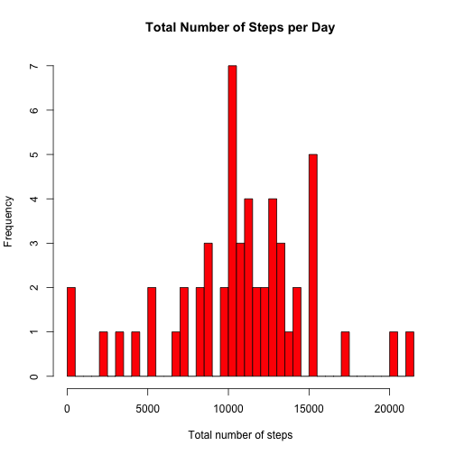
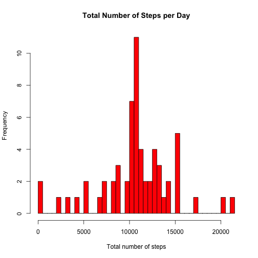
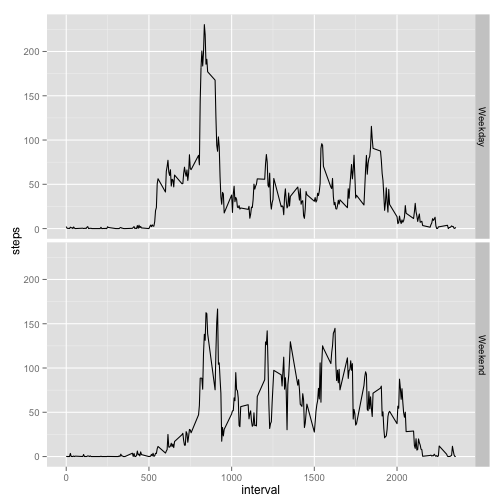

Reproducible Research: Peer Assessment 1
========================================================

## Loading and preprocessing the data


```r
activity <- read.csv("activity.csv")
```


## What is mean total number of steps taken per day?

1. Make a histogram of the total number of steps taken each day


```r
x <- aggregate(steps ~ date, activity, sum)
hist(x$steps, main = "Total Number of Steps per Day", breaks = 60, col = "red", 
    xlab = "Total number of steps")
```

 


2. Calculate and report the **mean** and **median** total number of steps taken per day.


```r
summary(x$steps)
```

```
##    Min. 1st Qu.  Median    Mean 3rd Qu.    Max. 
##      41    8840   10800   10800   13300   21200
```


- In the summary above, we see that the mean and median are 10,800.

## What is the average daily activity pattern?

1. Make a time series plot (i.e. type = "l") of the 5-minute interval (x-axis) and the average number of steps taken, averaged across all days (y-axis)


```r
y <- aggregate(steps ~ interval, activity, mean)
plot(y$interval, y$steps, type = "l", main = "Average Daily Activity Pattern", 
    cex.main = 0.75, cex.lab = 0.75, cex.axis = 0.6, ylab = "Average Number of Steps", 
    xlab = "5-Minute Interval")
```

 


2. Which 5-minute interval, on average across all the days in the dataset, contains the maximum number of steps?


```r
# locate the index of the dataframe with the max value
maxIndex <- which.max(y$steps)
# get the max value and interval using the index
y[maxIndex, ]
```

```
##     interval steps
## 104      835 206.2
```


- From the above we see that the 5-minute interval containing the maximum number of steps is 835 (with a max value of about 206). 

## Imputing missing values

Note that there are a number of days/intervals where there are missing values (coded as NA). The presence of missing days may introduce bias into some calculations or summaries of the data.

1. Calculate and report the total number of missing values in the dataset (i.e. the total number of rows with NAs)


```r
na <- is.na(activity)
summary(na)
```

```
##    steps            date          interval      
##  Mode :logical   Mode :logical   Mode :logical  
##  FALSE:15264     FALSE:17568     FALSE:17568    
##  TRUE :2304      NA's :0         NA's :0        
##  NA's :0
```

- The summary tells us that the number of missing values (TRUE) is 2,304.


2. Devise a strategy for filling in all of the missing values in the dataset. The strategy does not need to be sophisticated. For example, you could use the mean/median for that day, or the mean for that 5-minute interval, etc.

- Each missing value in the new dataframe will be replaced with the mean number of steps for its 5-minute interval.


3. Create a new dataset that is equal to the original dataset but with the missing data filled in.


```r
# creates a new dataframe equal to the original
NewData <- data.frame(activity)

# checks each row of the new dataframe for missing values and replaces it
# with the average number of steps for the given 5-minute interval
# (referenced from the 'y_new' dataset containing avg steps by interval,
# made earlier to generate the time series plot)

for (i in 1:nrow(NewData)) {
    if (is.na(NewData$steps[i])) {
        interval <- NewData$interval[i]
        index <- which(y$interval == interval)
        avgSteps <- y$steps[index]
        NewData$steps[i] <- avgSteps
    }
}
```


4. Make a histogram of the total number of steps taken each day and Calculate and report the **mean** and **median** total number of steps taken per day. Do these values differ from the estimates from the first part of the assignment? What is the impact of imputing missing data on the estimates of the total daily number of steps?


```r
x_new <- aggregate(steps ~ date, NewData, sum)
hist(x_new$steps, main = "Total Number of Steps per Day", breaks = 60, col = "red", 
    xlab = "Total number of steps")
```

 


```r
# original
summary(x$steps)
```

```
##    Min. 1st Qu.  Median    Mean 3rd Qu.    Max. 
##      41    8840   10800   10800   13300   21200
```

```r

# new
summary(x_new$steps)
```

```
##    Min. 1st Qu.  Median    Mean 3rd Qu.    Max. 
##      41    9820   10800   10800   12800   21200
```


- Above, we can see that the strategy to replace missing values worked very well, since the new estimated mean value and estimated median value are still 10,800. This makes sense given that the mean values from the original dataframe were simply used to replace all of the missing values. 

## Are there differences in activity patterns between weekdays and weekends?

For this part the weekdays() function may be of some help here. Use the dataset with the filled-in missing values for this part.

1. Create a new factor variable in the dataset with two levels – “weekday” and “weekend” indicating whether a given date is a weekday or weekend day.


```r
NewData$date <- as.Date(NewData$date, "%Y-%m-%d")
NewData$day <- weekdays(NewData$date)
NewData$dayType2 <- c("")

for (i in 1:nrow(NewData)) {
    if (NewData$day[i] == "Saturday" | NewData$day[i] == "Sunday") {
        NewData$dayType2[i] <- "Weekend"
    } else {
        NewData$dayType2[i] <- "Weekday"
    }
}
```


2. Make a panel plot containing a time series plot (i.e. type = "l") of the 5-minute interval (x-axis) and the average number of steps taken, averaged across all weekday days or weekend days (y-axis). 


```r
y_new <- aggregate(steps ~ interval + dayType2, NewData, mean)

library(ggplot2)
qplot(interval, steps, data = y_new, facets = dayType2 ~ ., geom = "path")
```

 

